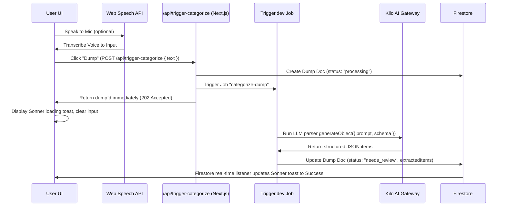

# LifeDump Application Documentation

This document describes the architecture, tech stack, data models, workflows, and file structure of the **LifeDump** application.

---

## 1. Architecture & Design Overview

LifeDump is a single-space productivity dashboard designed to help users quickly offload ("dump") tasks, expenses, and notes through text or speech. An AI model categorizes the input, which is reviewed by the user and saved to a cloud database.

The application follows a modern serverless React architecture:

- **Frontend**: Next.js App Router (React 19) with Tailwind CSS v4.
- **State Management**: Zustand (local UI state / pending items) and TanStack React Query (server state / caching).
- **Authentication**: Clerk (managed authentication & user sessions).
- **Database**: Firebase Firestore (NoSQL document storage organized by user ID).
- **AI Engine**: Vercel AI SDK executing structured schema generation using the Kilo AI Gateway provider.
- **Shared AI Layer**: `services/ai.ts` centralizes AI client config, prompt builders, Zod schemas, type guards, and salvage/extraction logic, keeping API routes and background Trigger.dev tasks on the same categorization/refinement prompts.
- **Constants & Query Keys**: `lib/app-constants.ts` provides icon-free shared runtime constants (`queryKeys`, `AI_CONFIG`, `ITEM_COLLECTIONS`, `PRIORITY_WEIGHTS`) for hooks, services, and server code. `lib/constants.ts` exposes UI-only category display config (`CATEGORY_CONFIG`) and re-exports shared constants for compatibility.
- **Settings**: `/settings` stores per-user preferences in Firestore at `users/{userId}/settings/app` via `hooks/use-settings.ts`, including dark mode access, custom OpenAI-compatible AI base URL/API key/model, manual or `/models` model selection, and suggested workflow toggles.
- **Metadata**: `app/layout.tsx` exports root Next.js metadata with `applicationName: "LifeDump"` and a default/template title for browser/app surfaces.
- **UI/UX System**: `app/globals.css` defines shared LifeDump page/header/card utility classes (`ld-page-shell`, `ld-page-title`, `ld-glass-card`) plus ambient background gradients. Core feature screens now share consistent page rhythm and glass-card surfaces.
- **Error Boundary**: `components/error-boundary.tsx` wraps the main app layout with a class-based React error boundary that catches rendering errors and displays a fallback UI with "Try Again" reset and "Go Home" navigation, preventing full-page white-screens.

---

## 2. Technology Stack & Key Dependencies

The primary dependencies defined in `package.json` are:

| Category             | Dependency              | Version    | Description                                             |
| :------------------- | :---------------------- | :--------- | :------------------------------------------------------ |
| **Core**             | `next`                  | `16.2.6`   | Next.js Framework (App Router, Server Actions/Handlers) |
|                      | `react` / `react-dom`   | `19.2.4`   | React 19.0 UI Library                                   |
| **Authentication**   | `@clerk/nextjs`         | `^7.5.3`   | User identity and session management                    |
| **Database**         | `firebase`              | `^12.14.0` | Client Firestore database & Storage configuration       |
|                      | `firebase-admin`        | `^14.0.0`  | Server-side Firebase Admin SDK                          |
| **AI Integration**   | `ai`                    | `^6.0.206` | Vercel AI SDK for LLM prompts and structured outputs    |
|                      | `@ai-sdk/openai`        | `^3.0.71`  | OpenAI provider (configured for Kilo AI Gateway)        |
| **Data Fetching**    | `@tanstack/react-query` | `^5.101.0` | Server state query, caching, and mutations              |
| **State Management** | `zustand`               | `^5.0.14`  | Client-side transient state (raw text, pending items)   |
| **Styling & UI**     | `tailwindcss`           | `^4`       | Tailwind CSS v4 styling                                 |
|                      | `@base-ui/react`        | `^1.5.0`   | Headless primitive components                           |
|                      | `shadcn`                | `^4.11.0`  | Shadcn UI component system                              |
|                      | `lucide-react`          | `^1.18.0`  | Icon set                                                |

---

## 3. Database Schema (Firebase Firestore)

All data in Firestore is partitioned under a user-centric structure. All collections are subcollections of a specific user document, ensuring privacy and isolation:

`users/{userId}/{collectionName}/{documentId}`

There are four primary collection groups:

### 1. Dumps Collection (`users/{userId}/dumps`)

Stores the raw input text submitted by the user.

- **Fields**:
  - `userId`: `string`
  - `sourceType`: `"text" | "image" | "voice"`
  - `rawText`: `string` (optional)
  - `status`: `"processing" | "needs_review" | "confirmed" | "failed"`
  - `createdAt`: `Timestamp`
  - `updatedAt`: `Timestamp`

### 2. Standardized Item Collections (`tasks`, `finances`, `notes`)

All confirmed items share one top-level shell. Collection path stays category-specific:
`users/{userId}/{tasks|finances|notes}/{documentId}`.

- **Shared Fields**:
  - `userId`: `string`
  - `dumpId`: `string` (optional for future manual items)
  - `category`: `"task" | "finance" | "note"`
  - `title`: `string`
  - `content`: `string`
  - `tags`: `string[]`
  - `source`: `"manual" | "ai"`
  - `aiConfidence`: `number` (optional)
  - `createdAt`: `Timestamp`
  - `updatedAt`: `Timestamp`

### 3. Tasks Collection (`users/{userId}/tasks`)

Adds task-specific nested data only:

- `task.isCompleted`: `boolean`
- `task.dueAt`: `Timestamp` (optional)
- `task.priority`: `"none" | "low" | "medium" | "high"` (optional)

### 4. Finances Collection (`users/{userId}/finances`)

Adds finance-specific nested data only:

- `finance.type`: `"expense" | "income"`
- `finance.amount`: `number`
- `finance.currency`: `"IDR"`
- `finance.occurredAt`: `Timestamp`
- `finance.paymentMethod`: `string` (optional)

### 5. Notes Collection (`users/{userId}/notes`)

Matches the simple note DTO using the shared shell:

- `title`: top-level note title
- `content`: top-level note body
- `tags`: top-level labels
- `source`: `"manual" | "ai"`
- `aiConfidence`: optional AI confidence
- `isPinned`: `boolean` (optional; defaults false in UI)

> Legacy compatibility: mappers still read old nested `task.tags`, `task.source`, `finance.tags`, `finance.source`, and `note.noteType` where present, but new writes use the standardized top-level fields.

### 6. Settings Document (`users/{userId}/settings/app`)

Stores each user's app preferences separately.

- `aiBaseUrl`: OpenAI-compatible gateway base URL.
- `aiApiKey`: custom gateway API key. Stored with the user's Firestore settings.
- `aiModel`: selected or manually typed model string.
- `aiModelMode`: `"manual" | "models"` (defaults to `"models"`).
- `autoEnhance`, `showCaptureHints`, `compactLists`, `confirmDestructiveActions`: suggested workflow toggles.
- `updatedAt`: server timestamp.

---

## 4. Workflows & Core Mechanisms

### Workflow A: AI Categorization & Extraction (Background Processing)



1.  **Input Submission**: The user writes in `UniversalInput` or uses the Microphone button (which hooks into the browser's native `SpeechRecognition` API).
2.  **Trigger Request**: The client issues a POST request to `/api/trigger-categorize` passing `{ text }`.
3.  **Dump Document Initialization**: The server-side API handler creates a dump document in the `users/{userId}/dumps` collection with `status: "processing"` and the `rawText`. It triggers the Trigger.dev background task `categorize-dump` and returns the `dumpId` immediately with HTTP status 202.
4.  **UI Feedback**: The client immediately clears the text input. The global `<DumpProcessingListener />` listens in real-time to the dump status. It fires a `toast.loading("Organizing your dump...")` using Sonner.
5.  **Trigger.dev Worker Processing**: The background worker calls Vercel AI SDK querying the `nvidia/nemotron-3-nano-omni-30b-a3b-reasoning:free` model via Kilo AI Gateway. Prompt construction lives in `services/ai.ts` so the legacy synchronous route and Trigger.dev tasks share the same categorization/refinement instructions. It parses Jakarta timezone-localized relative times and dates, and extracts structured items.
6.  **Firestore Write**: The background worker updates the dump document with `status: "needs_review"` and saving the `extractedItems` array, then finishes.
7.  **Real-time Synchronization**: The client's global listener receives the status update (`needs_review`) and upgrades the Sonner loading toast to a success toast with a "Review" button.

### Workflow B: Review & Refinement (Confirmation Drawer)

1.  **Inspect Extracted Items**: The user clicks the toast "Review" or clicks a dump card in the "Recent Dumps" list with a `"needs_review"` badge to open the global `<ConfirmationDrawer />`.
2.  **Refine & Modify**: The user can remove unwanted items using the trash icon. If they write a revision instruction/feedback:
    - The client issues a POST request to `/api/trigger-refine` passing `{ dumpId, feedback, currentItems }`.
    - The server updates the dump document status back to `"processing"`. This closes the drawer globally and shows the global background loading toast.
    - A Trigger.dev worker runs the refinement task (`refine-dump`) using the Kilo AI Gateway, updates `extractedItems` on the dump doc, and shifts the status back to `"needs_review"`.
    - The client's real-time listener updates the loading toast to a success toast, allowing the user to reopen the drawer and review the refined items.
3.  **Confirm & Save**: Clicking "Confirm All" calls `confirmDumpAndItems` which executes a batch transaction writing the confirmed items to their category subcollections (`tasks`, `finances`, or `notes`), updates the dump document's status to `"confirmed"`, and clears `extractedItems`.
4.  **Instant Refresh**: Firestore writes are reflected through the global realtime listeners, which update the TanStack Query cache via `setQueryData`. UI mutations do not manually invalidate/refetch cache-only queries.
5.  **Inspect Confirmed Dumps**: Clicking a confirmed dump in the "Recent Dumps" list navigates to `/dumps/[id]`, which displays the final confirmed/extracted items that belong to that dump.

### Workflow D: Failed Dump Redo

1.  **Inspect Failed Dumps**: If a dump processing fails, it appears in `/review` with a `"failed"` status badge and error logs.
2.  **Redo Request**: The user clicks "Redo" on the failed dump card, opening the Redo Dialog.
3.  **Provide Context**: The user can edit the original `rawText` or supply additional instruction/feedback.
4.  **Submit Redo**:
    - The client sends a POST request to `/api/trigger-redo` with `{ dumpId, rawText, feedback }`.
    - The API route updates the dump's status to `"processing"` (and updates the `rawText` if edited) and triggers the Trigger.dev task `redo-dump`.
    - The `redo-dump` worker runs the AI parsing using the updated context/feedback, updates the document status to `"needs_review"`, and lists the newly extracted items for confirmation.

### Workflow C: Real-time Database Synchronization

1.  **Subscription Activation**: When the authenticated user logs in, `<FirestoreRealtimeSync />` initiates live `onSnapshot` connections to the user's Firestore collections (`dumps`, `tasks`, `finances`, `notes`) and settings document.
2.  **Cache Syncing**: When any Firestore document changes:
    - The listener parses the raw documents into structured objects using `mapDocToDump` or `mapDocToItem`.
    - The parsed list is sorted chronologically (latest first).
    - The listener updates the corresponding TanStack React Query cache key directly using the `queryKeys` factory from `lib/app-constants.ts` (e.g. `queryKeys.dumps(userId)`, `queryKeys.itemsByCategory(userId, "task")`, `queryKeys.dump(dump.id, userId)`).
    - For items (`tasks`, `finances`, `notes`), the component uses a shared listener helper plus per-collection reference caches, then automatically merges and sorts them to update the master list cache key `queryKeys.items(userId)`.
    - User settings at `users/{userId}/settings/app` are mirrored into the local settings cache for AI request helpers.
3.  **UI Updates**: Any page or component listening to these React Query keys (like the Home Dashboard, Tasks Page, or Finance Page) automatically receives the updated cache and re-renders immediately, without requiring manual query invalidations or page reloads.

---

## 5. Directory & File Structure

```
lifedump/
├── .agents/                    # Local plugin agent scripts/skills configurations
├── app/                        # Next.js App Router root
│   ├── (app)/                  # Main Application Group (Auth Protected)
│   │   ├── dumps/
│   │   │   └── [id]/
│   │   │       └── page.tsx    # Raw dump text panel and category-wise items layout with edit/delete actions
│   │   ├── finances/
│   │   │   └── page.tsx        # Financial Ledger, Cashflow Statistics & savings progress
│   │   ├── notes/
│   │   │   └── page.tsx        # Searchable grid of general/journal notes with filters
│   │   ├── review/
│   │   │   └── page.tsx        # Lists processing, pending (needs review), and failed dumps; triggers global ConfirmationDrawer for reviewable items
│   │   ├── settings/
│   │   │   └── page.tsx        # Per-user appearance, AI endpoint/key/model, and workflow suggestion settings
│   │   ├── tasks/
│   │   │   └── page.tsx        # Active and Completed task management lists
│   │   ├── layout.tsx          # Auth wrapper; Header (with Bell notifications), Main layout container, and Bottom Nav
│   │   └── page.tsx            # Main dashboard: statistics overview, input panel, recent confirmed dumps feed
│   ├── api/
│   │   ├── ai/
│   │   │   └── models/
│   │   │       └── route.ts    # Authenticated OpenAI-compatible /models proxy for custom AI base URLs
│   │   │   └── test/
│   │   │       └── route.ts    # Authenticated model connection smoke test for Settings
│   │   ├── categorize/
│   │   │   └── route.ts        # AI categorization API utilizing Vercel AI SDK and Kilo AI Gateway
│   │   ├── trigger-categorize/
│   │   │   └── route.ts        # Initiates background processing and triggers Trigger.dev task
│   │   ├── trigger-refine/
│   │   │   └── route.ts        # Updates dump status to processing and triggers background refinement task
│   │   ├── trigger-redo/
│   │   │   └── route.ts        # Updates dump status/text and triggers background redo task
│   │   └── enhance-prompt/
│   │       └── route.ts        # AI prompt enhancement endpoint utilizing Vercel AI SDK
│   ├── sign-in/
│   │   └── [[...sign-in]]/     # Clerk Authentication pages
│   ├── sign-up/
│   │   └── [[...sign-up]]/     # Clerk Registration pages
│   ├── globals.css             # Main styling, custom Tailwind rules, font assignments
│   └── layout.tsx              # Root HTML wrapper with theme & auth providers
├── components/                 # React UI Components
│   ├── ui/                     # Subdirectory for individual Shadcn elements
│   ├── bottom-nav.tsx          # Bottom tab navbar with routing active states
│   ├── confirmation-drawer.tsx # Vaul drawer for review, edit, and refinement of pending items
│   ├── dump-processing-listener.tsx # Global background job status listener using Sonner toasts
│   ├── edit-dialog.tsx         # Dialog interface to update individual item parameters
│   ├── error-boundary.tsx      # React error boundary with fallback UI (Try Again, Go Home)
│   ├── firestore-realtime-sync.tsx # Global Firestore onSnapshot cache synchronizer
│   ├── header.tsx              # Top app navigation containing brand, review shortcut, user profile
│   ├── item-card.tsx           # Shared entity-aware card component (ItemCard, ItemCardSkeleton, ItemCategoryMark) for task/finance/note display
│   ├── providers.tsx           # Wraps application with QueryClientProvider
│   ├── theme-provider.tsx      # Theme toggle contexts & keypress hotkeys
│   ├── theme-toggle.tsx        # Icon trigger to change theme
│   └── universal-input.tsx     # Smart input textarea with microphone, AI prompt enhancement, and submission buttons
├── hooks/                      # Custom React Hooks (React Query integration)
│   ├── use-dumps.ts            # Custom hooks for fetching all dumps, fetching by ID (via dedicated queryKey), and deleting dumps
│   └── use-items.ts            # Custom hooks for fetching, toggling, editing, and deleting items
│   └── use-settings.ts         # Per-user Firestore settings persistence and AI request settings helper
├── lib/                        # Shared utilities and constants
│   ├── app-constants.ts        # Icon-free runtime constants (queryKeys, AI_CONFIG, ITEM_COLLECTIONS, priority weights)
│   ├── utils.ts                # Utility functions (cn, formatRelativeTime, formatDateForInput)
│   └── constants.ts            # UI category display constants (CATEGORY_CONFIG) and compatibility re-exports
├── proxy.ts                    # Next.js 16 Proxy entrypoint (Clerk authentication)
├── services/                   # Backend services and mappers
│   ├── firebase.ts             # Initializes client-side Firebase connections
│   ├── firestore.ts            # Houses database write operations (batch saves)
│   ├── mappers.ts              # Translates API schema structures into frontend Zustand types
│   └── queries.ts              # Handles Firestore read, update, and delete functions
├── stores/                     # Zustand Global States
│   └── use-dump-store.ts       # Central store with decoupled PendingItem type
├── triggers/                   # Trigger.dev background worker jobs directory
│   └── categorize.ts           # Durable AI categorization extraction task
├── types/                      # Application typescript interface definitions
│   └── index.ts                # Common domain type signatures (Item, Dump, TaskData, FinanceData, etc.)
├── AGENTS.md                   # System rules and instructions file for Agent environments
├── components.json             # Shadcn configuration file
├── next.config.ts              # Next.js settings, including package import optimization for large UI barrels
├── package.json                # Project dependencies and operational scripts
├── trigger.config.ts           # Trigger.dev integration configuration settings
└── tsconfig.json               # Typescript compilation settings
```

---

## 6. Page & Component Details

### `app/(app)/page.tsx` (Home Dashboard)

- **Statistics**: Computes derived indicators in a single memoized pass over real-time synced items:
  - Active/pending tasks count.
  - Notes count.
  - Net cashflow (total income minus total expenses) formatted for IDR currency.
- **Main Input**: Embeds `<UniversalInput />` to accept new entries.
- **Shared Shell**: Uses the shared `ld-page-shell` and title/kicker utilities for consistent spacing and hierarchy.
- **Recent Dumps Feed**: Displays user dumps in a real-time list (`useDumpsQuery` synchronized via `<FirestoreRealtimeSync />`) with client-side local pagination. Features a "Load More" button to increment the visible slice of dumps. Displays raw text, source type, creation time, previews of generated items, and a delete action. Clicking a dump navigates to `/dumps/[id]`.
- **Audit Hygiene**: Dashboard modules keep imports and store selectors scoped to values used by the component, group dump items without repeated array copies, and avoid stale dependencies/lint noise.

### `app/(app)/dumps/[id]/page.tsx` (Dump Detail Page)

- **Header**: Features a back-navigation link to return to the home dashboard.
- **Raw Dump Card**: Styled glassmorphic container detailing the raw source text, its media type (text/image/voice), and Jakarta-localized timestamp.
- **Extracted Items Feed**: Identifies and groups all items generated by the dump (tasks, finances, and notes).
- **Interactive Operations**:
  - Tasks: includes toggle checkboxes to quickly update completion status.
  - Finances: details structured amount indicators.
  - Modifications: Pencil icon launches `<EditDialog />` to change entity-specific details (task due/priority, finance amount/type/date/payment method, note type/pin), and Trash2 executes query deletion, updating dashboard caches instantly.

### `app/(app)/tasks/page.tsx` (Tasks Dashboard)

- Queries `getItemsByCategory(userId, 'task')`.
- Splits items into **Active** and **Completed** lists inside separate tabs.
- **Overdue logic**: Computes if a task's due date is earlier than today (and incomplete) and flags it with a red warning badge.
- **Sorting & Filtering**: Supports filtering by `priority` level and custom `tags`. Filtering, splitting active/completed tasks, and sorting are derived in one memoized pass using shared `PRIORITY_WEIGHTS`.
- **Visual Highlights**: Displays priority badges, tags list, reminder indicator, and AI source indicators.
- **UX Polish**: Uses shared page header styling and global `ItemCard` refinements for better truncation, spacing, hover state, and overdue emphasis.

### `app/(app)/finances/page.tsx` (Finance Dashboard)

- Queries `getItemsByCategory(userId, 'finance')`.
- Shows summary totals: **Expenses**, **Income**, and **Net Cashflow**. Expense/income buckets and totals are derived in a single memoized pass.
- **Savings Rate**: Renders a custom `<Progress />` bar representing the ratio of savings to income: `(Net Cashflow / Total Income) * 100`.
- Displays transactions in tabs: _All_, _Expenses_, or _Income_.
- **UX Polish**: Summary cards use shared glass-card treatment and consistent page header styling.

### `app/(app)/notes/page.tsx` (Notes Dashboard)

- Queries `getItemsByCategory(userId, 'note')`.
- Provides a memoized search bar that checks note title and content body text.
- Search also matches tags. Pinned notes sort before unpinned notes, then by newest creation time, with a highlighted pin action state.
- Provides filter tabs to view: _All_, _General_ notes, or _Journal_ entries.

### `app/(app)/review/page.tsx` (Review Dashboard)

- Queries `getDumps(userId)`.
- Filters for dumps with status `"needs_review"`, `"processing"`, or `"failed"`.
- Displays raw dump contents along with their extracted item counts.
- Clicking a card with `"needs_review"` status opens the global `ConfirmationDrawer` to finalize review.
- For `"failed"` status dumps, displays the processing error message and a "Redo" button.
- Clicking "Redo" opens a dialog allowing the user to edit the original text and/or provide additional instruction/context (feedback), updating the raw text and sending a refinement request to retry the AI categorization.
- Features a Trash/Delete button on each dump card to permanently delete the dump (e.g. to discard processing/failed/reviewable dumps).
- Shows a beautiful empty check state when all reviews are completed.
- Review access is visible in both the top notification button and bottom navigation. The header notification shows an actionable pending/failed count.
- Redo requests include the saved custom AI base URL/API key/model settings.

### `app/(app)/settings/page.tsx` (Settings)

- Provides a dark mode switch using the existing theme provider.
- Stores a custom OpenAI-compatible AI base URL, API key, model mode, and model string in `users/{userId}/settings/app`, with `localStorage` as a local cache.
- Auto-loads available models in the default `/models` selection mode by calling the authenticated `/api/ai/models` route, which requests `{baseUrl}/models` using the user's custom API key first, then the server-side `KILO_API_KEY`, and exposes returned model IDs for selection.
- Lets the user switch between selecting from `/models` results and an optional manually typed model string.
- Includes a "Test model connection" action that calls `/api/ai/test` and expects a tiny completion response from the configured base URL/key/model.
- Includes suggested browser-local workflow toggles: auto-enhance drafts, show capture hints, compact lists, and confirm destructive actions.
- Settings are per-user; each authenticated user reads/writes their own Firestore settings document.

### `components/header.tsx` (Header Nav & Notifications)

- Includes brand link, Clerk user session menu, and a review shortcut.
- Includes a `Bell` icon that navigates to `/review`.
- Includes a real-time reactive notification count for dumps needing review plus failed dumps.

### `components/bottom-nav.tsx` (Mobile Primary Nav)

- Includes Tasks, Finances, Home, Notes, and Settings routes.
- Uses safe-area-aware fixed positioning, active-route indicators, and a raised center Home action styled like a mobile tab bar primary button.

### `components/theme-provider.tsx` (Theme Engine)

- Provides a small class-based client theme context that stores the selected theme in `localStorage` under `lifedump-theme` and toggles the `dark` class on `<html>`.
- Avoids provider-injected `<script>` tags during client component rendering, preventing React 19 / Next 16 script rendering warnings.
- **Theme Hotkey**: Listens to global `keydown` events. If the user presses the letter `d` (case-insensitive) while not typing inside an input/textarea/select element, the theme resolved value toggles between `dark` and `light`.

### `components/universal-input.tsx` (Dump Composer)

- Detects Web Speech API support after hydration and only then renders the microphone button, keeping the server-rendered and first client-rendered trees identical.
- Presents the primary capture flow as a prominent rounded glass composer with helper copy, listening state, character count, accessible microphone labels, stronger submit CTA, and user-facing submit/speech error toasts.
- Sends saved AI base URL/API key/model settings with enhance and categorize requests.

### `components/item-card.tsx` (Shared Item Surface)

- Provides the shared card surface for tasks, finance records, notes, and review drafts.
- Uses entity-aware display patterns: tasks show completion state, due date, priority, and overdue status; finances show income/expense amount, occurred date, and payment method; notes show note type and pinned state; all items can show tags, source, timestamps, AI confidence, and clarification status.

### `components/edit-dialog.tsx` (Entity Editor)

- Edits common item fields (`title`, `content`, `tags`, `source`) plus category-specific attributes.
- Tasks expose `dueAt` and `priority` while preserving completion state.
- Finances expose `amount`, `type`, `occurredAt`, `currency`, and optional `paymentMethod`.
- Notes expose `note.noteType` and `isPinned`.

### `components/add-item-dialog.tsx` (Manual Entity Creator)

- Creates new items manually with category-specific attributes.
- Tasks expose `dueAt`, `priority`, and `isCompleted`.
- Finances expose `amount`, `type`, `occurredAt`, and optional `paymentMethod`.
- Notes expose `note.noteType` and `isPinned`.

### `components/confirmation-drawer.tsx` (AI Review Drawer)

- Displays item totals grouped by task/finance/note, a short raw-input preview for context, review-style item cards, and clearer refinement examples before confirming or refining extracted items.
- Sends saved AI base URL/API key/model settings with refinement requests.

### `hooks/use-settings.ts` (User Settings)

- Defines `AppSettings`, `defaultSettings`, `useSettings()`, and `getAiRequestSettings()`.
- Persists settings to Firestore at `users/{userId}/settings/app`, mirrors them to `localStorage` under `lifedump-settings`, and keeps custom AI request settings available to client fetch calls.

### `components/error-boundary.tsx` (Error Boundary)

- A class-based React error boundary (required pattern — functional components cannot implement `getDerivedStateFromError`).
- Wraps `Header`, `<main>`, and `BottomNav` inside `app/(app)/layout.tsx`, leaving side-effect-only components (listeners, drawer) outside to keep them functional even if the UI crashes.
- Catches rendering errors via `getDerivedStateFromError` and logs them via `componentDidCatch`.
- Displays a fallback UI with:
  - Warning icon and "Something went wrong" title.
  - Collapsible `<details>` element showing the error message and stack trace.
  - "Try Again" button that resets the error state via `handleReset`.
  - "Go Home" button using Next.js `<Link>` for safe navigation.
- Supports an optional `fallback` prop for custom error UIs.

### `lib/app-constants.ts` and `lib/constants.ts` (Shared Constants)

- **`lib/app-constants.ts`**: Icon-free shared constants safe for server, service, hook, and client imports:
  - `queryKeys`: TanStack React Query cache key factory.
  - `AI_CONFIG`: Single source of truth for the Kilo AI Gateway base URL, model name, and timezone.
  - `ITEM_COLLECTIONS`: Shared category-to-Firestore-subcollection mapping used by read/write helpers.
  - `PRIORITY_WEIGHTS`: Numeric weights for task priority sorting (`high: 3`, `medium: 2`, `low: 1`, `none: 0`).
- **`queryKeys`** generates all TanStack React Query cache keys:
  - `queryKeys.dumps(userId)` → `["dumps", userId]`
  - `queryKeys.dump(dumpId, userId)` → `["dump", dumpId, userId]` — used by `useDumpByIdQuery` and populated by `FirestoreRealtimeSync`
  - `queryKeys.items(userId)` → `["items", userId]`
  - `queryKeys.itemsByCategory(userId, category)` → `["items", userId, category]`
  - All parameters accept `string | null | undefined` to match hook signatures; queries are gated by `enabled` flags.
- **`lib/constants.ts`**: UI-facing category constants. It owns `CATEGORY_CONFIG` (centralized icon and badge variant mappings for task/finance/note categories) and re-exports icon-free constants for compatibility.

### API Route Type-Safety & Trigger Integration

- API routes parse `req.json()` into narrow body shapes instead of `any`, validate required fields before side effects, and return safe fallback error messages for unknown thrown values.
- Trigger routes (`trigger-categorize`, `trigger-redo`, `trigger-refine`) create/update dump status then enqueue Trigger.dev jobs with typed payloads.
- AI prompt builders, categorization execution, custom AI runtime settings (base URL, API key, model), and salvage paths live in `services/ai.ts`; both API routes and Trigger.dev tasks reuse them before persisting or returning items.
- `/api/ai/models` is an authenticated helper route that validates HTTP(S) base URLs and fetches available model IDs from an OpenAI-compatible `/models` endpoint using the user's custom key when supplied.
- `/api/ai/test` is an authenticated helper route that performs a minimal text generation request against the configured gateway/model and returns success/output for Settings feedback.
- `/api/enhance-prompt` includes a small SSE salvage path for custom gateways that return OpenAI Responses `text/event-stream` chunks instead of the JSON body expected by the Vercel AI SDK.

### Next.js 16 & Bundle Hygiene

- `proxy.ts` is the Clerk-authenticated Next.js Proxy entrypoint; the deprecated `middleware.ts` convention is not used.
- `next.config.ts` uses `experimental.optimizePackageImports` for `radix-ui` and `@base-ui/react` barrel imports. Next.js already optimizes `lucide-react`, `date-fns`, and `recharts` by default.
