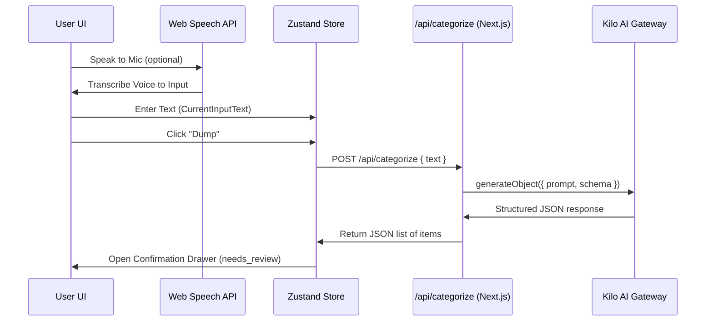

# LifeDump Application Documentation

This document describes the architecture, tech stack, data models, workflows, and file structure of the **LifeDump** application.

---

## 1. Architecture & Design Overview
LifeDump is a single-space productivity dashboard designed to help users quickly offload ("dump") tasks, expenses, and notes through text or speech. An AI model categorizes the input, which is reviewed by the user and saved to a cloud database.

The application follows a modern serverless React architecture:
*   **Frontend**: Next.js App Router (React 19) with Tailwind CSS v4.
*   **State Management**: Zustand (local UI state / pending items) and TanStack React Query (server state / caching).
*   **Authentication**: Clerk (managed authentication & user sessions).
*   **Database**: Firebase Firestore (NoSQL document storage organized by user ID).
*   **AI Engine**: Vercel AI SDK executing structured schema generation using the Kilo AI Gateway provider.

---

## 2. Technology Stack & Key Dependencies
The primary dependencies defined in `package.json` are:

| Category | Dependency | Version | Description |
| :--- | :--- | :--- | :--- |
| **Core** | `next` | `16.2.6` | Next.js Framework (App Router, Server Actions/Handlers) |
| | `react` / `react-dom` | `19.2.4` | React 19.0 UI Library |
| **Authentication** | `@clerk/nextjs` | `^7.5.3` | User identity and session management |
| **Database** | `firebase` | `^12.14.0` | Client Firestore database & Storage configuration |
| | `firebase-admin` | `^14.0.0` | Server-side Firebase Admin SDK |
| **AI Integration** | `ai` | `^6.0.206` | Vercel AI SDK for LLM prompts and structured outputs |
| | `@ai-sdk/openai` | `^3.0.71` | OpenAI provider (configured for Kilo AI Gateway) |
| **Data Fetching** | `@tanstack/react-query` | `^5.101.0` | Server state query, caching, and mutations |
| **State Management** | `zustand` | `^5.0.14` | Client-side transient state (raw text, pending items) |
| **Styling & UI** | `tailwindcss` | `^4` | Tailwind CSS v4 styling |
| | `next-themes` | `^0.4.6` | Theme management (light/dark mode toggle & system sync) |
| | `@base-ui/react` | `^1.5.0` | Headless primitive components |
| | `shadcn` | `^4.11.0` | Shadcn UI component system |
| | `lucide-react` | `^1.18.0` | Icon set |

---

## 3. Database Schema (Firebase Firestore)
All data in Firestore is partitioned under a user-centric structure. All collections are subcollections of a specific user document, ensuring privacy and isolation:

`users/{userId}/{collectionName}/{documentId}`

There are four primary collection groups:

### 1. Dumps Collection (`users/{userId}/dumps`)
Stores the raw input text submitted by the user.
*   **Fields**:
    *   `userId`: `string`
    *   `sourceType`: `"text" | "image" | "voice"`
    *   `rawText`: `string` (optional)
    *   `status`: `"processing" | "needs_review" | "confirmed" | "failed"`
    *   `createdAt`: `Timestamp`
    *   `updatedAt`: `Timestamp`

### 2. Tasks Collection (`users/{userId}/tasks`)
Stores items categorized as tasks.
*   **Fields**:
    *   `userId`: `string`
    *   `dumpId`: `string` (references the dump document that generated this task)
    *   `category`: `"task"`
    *   `title`: `string`
    *   `content`: `string` (mandatory task description)
    *   `task`:
        *   `isCompleted`: `boolean`
        *   `dueAt`: `Timestamp` (optional)
    *   `aiConfidence`: `number`
    *   `createdAt`: `Timestamp`
    *   `updatedAt`: `Timestamp`

### 3. Finances Collection (`users/{userId}/finances`)
Stores transaction and cashflow records.
*   **Fields**:
    *   `userId`: `string`
    *   `dumpId`: `string`
    *   `category`: `"finance"`
    *   `title`: `string`
    *   `content`: `string` (mandatory transaction details/reason)
    *   `finance`:
        *   `type`: `"expense" | "income"`
        *   `amount`: `number`
        *   `currency`: `"IDR"`
        *   `occurredAt`: `Timestamp`
    *   `aiConfidence`: `number`
    *   `createdAt`: `Timestamp`
    *   `updatedAt`: `Timestamp`

### 4. Notes Collection (`users/{userId}/notes`)
Stores general notes or journals.
*   **Fields**:
    *   `userId`: `string`
    *   `dumpId`: `string`
    *   `category`: `"note"`
    *   `title`: `string`
    *   `content`: `string` (mandatory note details/body)
    *   `note`:
        *   `noteType`: `"general" | "journal"`
    *   `aiConfidence`: `number`
    *   `createdAt`: `Timestamp`
    *   `updatedAt`: `Timestamp`

---

## 4. Workflows & Core Mechanisms

### Workflow A: AI Categorization & Extraction


1.  **Input Submission**: The user writes in `UniversalInput` or uses the Microphone button (which hooks into the browser's native `SpeechRecognition` API).
2.  **API Call**: The client issues a POST request to `/api/categorize` passing `{ text }`.
3.  **LLM Parsing**: The server-side API handler formats the current timestamp into the **Jakarta timezone (Asia/Jakarta)** and passes it to the Vercel AI SDK. It queries the `kilo-auto/free` model via Kilo AI Gateway, instructing it to parse relative dates/times (supporting both date and time) relative to the Jakarta context and format all output timestamps with a **+07:00 offset**, under a strict `Zod` schema:
    ```typescript
    const categorizeSchema = z.object({
      items: z.array(
        z.object({
          category: z.enum(["task", "finance", "note"]),
          title: z.string(),
          content: z.string(),
          dueAt: z.string().nullable().optional(),
          financeType: z.enum(["expense", "income"]).optional(),
          amount: z.number().optional(),
          currency: z.literal("IDR").optional(),
          occurredAt: z.string().optional(),
          confidence: z.number(),
          needsClarification: z.boolean(),
        })
      ),
      assumptions: z.array(z.string()).optional(),
    })
    ```
4.  **Pending State**: The structured response items are mapped via `mapApiItemsToPendingItems` into the Zustand store (`extractedItems`), shifting `dumpStatus` to `"needs_review"`.

### Workflow B: Review & Refinement (AI Loop)
1.  **View Drafts**: The `ConfirmationDrawer` displays the parsed items. The user can review the proposed category, title, due dates, amounts, etc.
2.  **AI Refinement Prompt**: If the categorization is incorrect or needs adjustments, the user writes correction instructions (e.g., *"Change item 2 to income instead"* or *"Set due date to next Friday"*).
3.  **Refine Request**: The client posts to `/api/categorize` sending the original `text`, the current draft `items`, and the user's `feedback` prompt.
4.  **Refined Response**: The Kilo model reviews the existing items, applies the feedback adjustments, and returns an updated structured list.
5.  **Remove & Confirm**: Users can manually delete items using a trash button or click "Confirm All" to write them to Firestore. Saving is done as a Firestore Batch transaction via `saveDumpAndItems` inside `lib/firestore.ts`.

---

## 5. Directory & File Structure
```
lifedump/
├── .agents/                    # Local plugin agent scripts/skills configurations
├── app/                        # Next.js App Router root
│   ├── (app)/                  # Main Application Group (Auth Protected)
│   │   ├── dumps/
│   │   │   └── [id]/
│   │   │       └── page.tsx    # Raw dump text panel and category-wise items layout with edit/delete actions
│   │   ├── finances/
│   │   │   └── page.tsx        # Financial Ledger, Cashflow Statistics & savings progress
│   │   ├── notes/
│   │   │   └── page.tsx        # Searchable grid of general/journal notes with filters
│   │   ├── tasks/
│   │   │   └── page.tsx        # Active and Completed task management lists
│   │   ├── layout.tsx          # Auth wrapper; Header, Main layout container, and Bottom Nav
│   │   └── page.tsx            # Main dashboard: statistics overview, input panel, recent feed
│   ├── api/
│   │   └── categorize/
│   │       └── route.ts        # AI categorization API utilizing Vercel AI SDK and Kilo AI Gateway
│   ├── sign-in/
│   │   └── [[...sign-in]]/     # Clerk Authentication pages
│   ├── sign-up/
│   │   └── [[...sign-up]]/     # Clerk Registration pages
│   ├── globals.css             # Main styling, custom Tailwind rules, font assignments
│   └── layout.tsx              # Root HTML wrapper with theme & auth providers
├── components/                 # React UI Components
│   ├── ui/                     # Subdirectory for individual Shadcn elements
│   ├── bottom-nav.tsx          # Bottom tab navbar with routing active states
│   ├── confirmation-drawer.tsx # Vaul drawer for review, edit, and refinement of pending items
│   ├── edit-dialog.tsx         # Dialog interface to update individual item parameters
│   ├── header.tsx              # Top app navigation containing title, theme switch, user profile
│   ├── providers.tsx           # Wraps application with QueryClientProvider
│   ├── theme-provider.tsx      # Theme toggle contexts & keypress hotkeys
│   ├── theme-toggle.tsx        # Icon trigger to change theme
│   └── universal-input.tsx     # Smart input textarea with microphone toggle
├── hooks/                      # Custom React Hooks
├── lib/                        # Shared Helpers, Database Clients, Types
│   ├── firebase.ts             # Initializes client-side Firebase connections
│   ├── firestore.ts            # Houses database write operations (batch saves)
│   ├── mappers.ts              # Translates API schema structures into frontend Zustand types
│   ├── queries.ts              # Handles Firestore read, update, and delete functions
│   ├── types.ts                # Application typescript interface definitions
│   └── utils.ts                # Utility class name merge helper (cn)
├── store/                      # Zustand Local States
│   └── use-dump-store.ts       # Central store managing current input text, pending items list, status
├── AGENTS.md                   # System rules and instructions file for Agent environments
├── components.json             # Shadcn configuration file
├── next.config.ts              # Next.js specific settings
├── package.json                # Project dependencies and operational scripts
└── tsconfig.json               # Typescript compilation settings
```

---

## 6. Page & Component Details

### `app/(app)/page.tsx` (Home Dashboard)
*   **Statistics**: Computes derived indicators:
    *   Active/pending tasks count.
    *   Notes count.
    *   Net cashflow (total income minus total expenses) formatted for IDR currency.
*   **Main Input**: Embeds `<UniversalInput />` to accept new entries.
*   **Recent Dumps Feed**: Pulls the most recent 4 raw dumps using a React Query cache lookup to `getDumps`. Displays the raw text of each dump, its source type, creation time, and preview badges of all generated items. Clicking a dump navigates to `/dumps/[id]`.

### `app/(app)/dumps/[id]/page.tsx` (Dump Detail Page)
*   **Header**: Features a back-navigation link to return to the home dashboard.
*   **Raw Dump Card**: Styled glassmorphic container detailing the raw source text, its media type (text/image/voice), and Jakarta-localized timestamp.
*   **Extracted Items Feed**: Identifies and groups all items generated by the dump (tasks, finances, and notes).
*   **Interactive Operations**:
    *   Tasks: includes toggle checkboxes to quickly update completion status.
    *   Finances: details structured amount indicators.
    *   Modifications: Pencil icon launches `<EditDialog />` to change details, and Trash2 executes query deletion, updating dashboard caches instantly.

### `app/(app)/tasks/page.tsx` (Tasks Dashboard)
*   Queries `getItemsByCategory(userId, 'task')`.
*   Splits items into **Active** and **Completed** lists inside separate tabs.
*   **Overdue logic**: Computes if a task's due date is earlier than today (and incomplete) and flags it with a red warning badge.

### `app/(app)/finances/page.tsx` (Finance Dashboard)
*   Queries `getItemsByCategory(userId, 'finance')`.
*   Shows summary totals: **Expenses**, **Income**, and **Net Cashflow**.
*   **Savings Rate**: Renders a custom `<Progress />` bar representing the ratio of savings to income: `(Net Cashflow / Total Income) * 100`.
*   Displays transactions in tabs: *All*, *Expenses*, or *Income*.

### `app/(app)/notes/page.tsx` (Notes Dashboard)
*   Queries `getItemsByCategory(userId, 'note')`.
*   Provides a search bar that checks note title and content body text.
*   Provides filter tabs to view: *All*, *General* notes, or *Journal* entries.

### `components/theme-provider.tsx` (Theme Engine)
*   Integrates `next-themes` with `attribute="class"`.
*   **Theme Hotkey**: Listens to global `keydown` events. If the user presses the letter `d` (case-insensitive) while not typing inside an input/textarea/select element, the theme resolved value toggles between `dark` and `light`.
