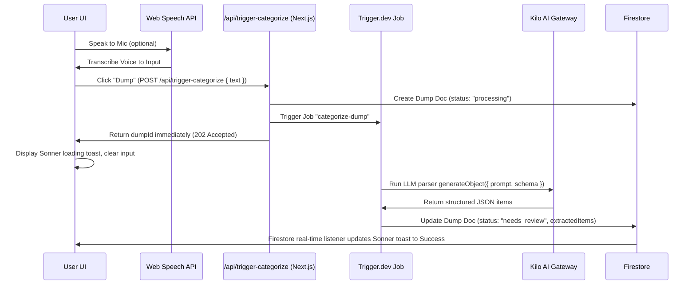

# LifeDump Application Documentation

This document describes the architecture, tech stack, data models, workflows, and file structure of the **LifeDump** application.

---

## 1. Architecture & Design Overview
LifeDump is a single-space productivity dashboard designed to help users quickly offload ("dump") tasks, expenses, and notes through text or speech. An AI model categorizes the input, which is reviewed by the user and saved to a cloud database.

The application follows a modern serverless React architecture:
*   **Frontend**: Next.js App Router (React 19) with Tailwind CSS v4.
*   **State Management**: Zustand (local UI state / pending items) and TanStack React Query (server state / caching).
*   **Authentication**: Clerk (managed authentication & user sessions).
*   **Database**: Firebase Firestore (NoSQL document storage organized by user ID).
*   **AI Engine**: Vercel AI SDK executing structured schema generation using the Kilo AI Gateway provider.

---

## 2. Technology Stack & Key Dependencies
The primary dependencies defined in `package.json` are:

| Category | Dependency | Version | Description |
| :--- | :--- | :--- | :--- |
| **Core** | `next` | `16.2.6` | Next.js Framework (App Router, Server Actions/Handlers) |
| | `react` / `react-dom` | `19.2.4` | React 19.0 UI Library |
| **Authentication** | `@clerk/nextjs` | `^7.5.3` | User identity and session management |
| **Database** | `firebase` | `^12.14.0` | Client Firestore database & Storage configuration |
| | `firebase-admin` | `^14.0.0` | Server-side Firebase Admin SDK |
| **AI Integration** | `ai` | `^6.0.206` | Vercel AI SDK for LLM prompts and structured outputs |
| | `@ai-sdk/openai` | `^3.0.71` | OpenAI provider (configured for Kilo AI Gateway) |
| **Data Fetching** | `@tanstack/react-query` | `^5.101.0` | Server state query, caching, and mutations |
| **State Management** | `zustand` | `^5.0.14` | Client-side transient state (raw text, pending items) |
| **Styling & UI** | `tailwindcss` | `^4` | Tailwind CSS v4 styling |
| | `next-themes` | `^0.4.6` | Theme management (light/dark mode toggle & system sync) |
| | `@base-ui/react` | `^1.5.0` | Headless primitive components |
| | `shadcn` | `^4.11.0` | Shadcn UI component system |
| | `lucide-react` | `^1.18.0` | Icon set |

---

## 3. Database Schema (Firebase Firestore)
All data in Firestore is partitioned under a user-centric structure. All collections are subcollections of a specific user document, ensuring privacy and isolation:

`users/{userId}/{collectionName}/{documentId}`

There are four primary collection groups:

### 1. Dumps Collection (`users/{userId}/dumps`)
Stores the raw input text submitted by the user.
*   **Fields**:
    *   `userId`: `string`
    *   `sourceType`: `"text" | "image" | "voice"`
    *   `rawText`: `string` (optional)
    *   `status`: `"processing" | "needs_review" | "confirmed" | "failed"`
    *   `createdAt`: `Timestamp`
    *   `updatedAt`: `Timestamp`

### 2. Tasks Collection (`users/{userId}/tasks`)
Stores items categorized as tasks.
*   **Fields**:
    *   `userId`: `string`
    *   `dumpId`: `string` (references the dump document that generated this task)
    *   `category`: `"task"`
    *   `title`: `string`
    *   `content`: `string` (mandatory task description)
    *   `task`:
        *   `isCompleted`: `boolean`
        *   `dueAt`: `Timestamp` (optional)
    *   `aiConfidence`: `number`
    *   `createdAt`: `Timestamp`
    *   `updatedAt`: `Timestamp`

### 3. Finances Collection (`users/{userId}/finances`)
Stores transaction and cashflow records.
*   **Fields**:
    *   `userId`: `string`
    *   `dumpId`: `string`
    *   `category`: `"finance"`
    *   `title`: `string`
    *   `content`: `string` (mandatory transaction details/reason)
    *   `finance`:
        *   `type`: `"expense" | "income"`
        *   `amount`: `number`
        *   `currency`: `"IDR"`
        *   `occurredAt`: `Timestamp`
    *   `aiConfidence`: `number`
    *   `createdAt`: `Timestamp`
    *   `updatedAt`: `Timestamp`

### 4. Notes Collection (`users/{userId}/notes`)
Stores general notes or journals.
*   **Fields**:
    *   `userId`: `string`
    *   `dumpId`: `string`
    *   `category`: `"note"`
    *   `title`: `string`
    *   `content`: `string` (mandatory note details/body)
    *   `note`:
        *   `noteType`: `"general" | "journal"`
    *   `aiConfidence`: `number`
    *   `createdAt`: `Timestamp`
    *   `updatedAt`: `Timestamp`

---

## 4. Workflows & Core Mechanisms

### Workflow A: AI Categorization & Extraction (Background Processing)


1.  **Input Submission**: The user writes in `UniversalInput` or uses the Microphone button (which hooks into the browser's native `SpeechRecognition` API).
2.  **Trigger Request**: The client issues a POST request to `/api/trigger-categorize` passing `{ text }`.
3.  **Dump Document Initialization**: The server-side API handler creates a dump document in the `users/{userId}/dumps` collection with `status: "processing"` and the `rawText`. It triggers the Trigger.dev background task `categorize-dump` and returns the `dumpId` immediately with HTTP status 202.
4.  **UI Feedback**: The client immediately clears the text input. The global `<DumpProcessingListener />` listens in real-time to the dump status. It fires a `toast.loading("Organizing your dump...")` using Sonner.
5.  **Trigger.dev Worker Processing**: The background worker calls Vercel AI SDK querying the `kilo-auto/free` model via Kilo AI Gateway. It parses Jakarta timezone-localized relative times and dates, and extracts structured items.
6.  **Firestore Write**: The background worker updates the dump document with `status: "needs_review"` and saving the `extractedItems` array, then finishes.
7.  **Real-time Synchronization**: The client's global listener receives the status update (`needs_review`) and upgrades the Sonner loading toast to a success toast with a "Review" button.

### Workflow B: Review & Refinement (Confirmation Drawer)
1.  **Inspect Extracted Items**: The user clicks the toast "Review" or clicks a dump card in the "Recent Dumps" list with a `"needs_review"` badge to open the global `<ConfirmationDrawer />`.
2.  **Refine & Modify**: The user can remove unwanted items using the trash icon. If they write a revision instruction/feedback:
    *   The client issues a POST request to `/api/trigger-refine` passing `{ dumpId, feedback, currentItems }`.
    *   The server updates the dump document status back to `"processing"`. This closes the drawer globally and shows the global background loading toast.
    *   A Trigger.dev worker runs the refinement task using the Kilo AI Gateway, updates `extractedItems` on the dump doc, and shifts the status back to `"needs_review"`.
    *   The client's real-time listener updates the loading toast to a success toast, allowing the user to reopen the drawer and review the refined items.
3.  **Confirm & Save**: Clicking "Confirm All" calls `confirmDumpAndItems` which executes a batch transaction writing the confirmed items to their category subcollections (`tasks`, `finances`, or `notes`), updates the dump document's status to `"confirmed"`, and clears `extractedItems`.
4.  **Instant Refresh**: The query cache is invalidated, immediately updating the home dashboard stats and lists.
5.  **Inspect Confirmed Dumps**: Clicking a confirmed dump in the "Recent Dumps" list navigates to `/dumps/[id]`, which displays the final confirmed/extracted items that belong to that dump.

### Workflow C: Real-time Database Synchronization
1.  **Subscription Activation**: When the authenticated user logs in, `<FirestoreRealtimeSync />` initiates live `onSnapshot` connections to the user's Firestore collections (`dumps`, `tasks`, `finances`, and `notes`).
2.  **Cache Syncing**: When any Firestore document changes:
    *   The listener parses the raw documents into structured objects using `mapDocToDump` or `mapDocToItem`.
    *   The parsed list is sorted chronologically (latest first).
    *   The listener updates the corresponding TanStack React Query cache key directly (e.g. `["dumps", userId]`, `["items", userId, "task"]`).
    *   For items (`tasks`, `finances`, `notes`), the component maintains reference caches of each collection, and automatically merges and sorts them to update the master list cache key `["items", userId]`.
3.  **UI Updates**: Any page or component listening to these React Query keys (like the Home Dashboard, Tasks Page, or Finance Page) automatically receives the updated cache and re-renders immediately, without requiring manual query invalidations or page reloads.

---

## 5. Directory & File Structure
```
lifedump/
├── .agents/                    # Local plugin agent scripts/skills configurations
├── app/                        # Next.js App Router root
│   ├── (app)/                  # Main Application Group (Auth Protected)
│   │   ├── dumps/
│   │   │   └── [id]/
│   │   │       └── page.tsx    # Raw dump text panel and category-wise items layout with edit/delete actions
│   │   ├── finances/
│   │   │   └── page.tsx        # Financial Ledger, Cashflow Statistics & savings progress
│   │   ├── notes/
│   │   │   └── page.tsx        # Searchable grid of general/journal notes with filters
│   │   ├── review/
│   │   │   └── page.tsx        # Lists pending dumps that require review; triggers global ConfirmationDrawer
│   │   ├── tasks/
│   │   │   └── page.tsx        # Active and Completed task management lists
│   │   ├── layout.tsx          # Auth wrapper; Header (with Bell notifications), Main layout container, and Bottom Nav
│   │   └── page.tsx            # Main dashboard: statistics overview, input panel, recent feed
│   ├── api/
│   │   ├── categorize/
│   │   │   └── route.ts        # AI categorization API utilizing Vercel AI SDK and Kilo AI Gateway
│   │   ├── trigger-categorize/
│   │   │   └── route.ts        # Initiates background processing and triggers Trigger.dev task
│   │   └── trigger-refine/
│   │       └── route.ts        # Updates dump status to processing and triggers background refinement task
│   ├── sign-in/
│   │   └── [[...sign-in]]/     # Clerk Authentication pages
│   ├── sign-up/
│   │   └── [[...sign-up]]/     # Clerk Registration pages
│   ├── globals.css             # Main styling, custom Tailwind rules, font assignments
│   └── layout.tsx              # Root HTML wrapper with theme & auth providers
├── components/                 # React UI Components
│   ├── ui/                     # Subdirectory for individual Shadcn elements
│   ├── bottom-nav.tsx          # Bottom tab navbar with routing active states
│   ├── confirmation-drawer.tsx # Vaul drawer for review, edit, and refinement of pending items
│   ├── dump-processing-listener.tsx # Global background job status listener using Sonner toasts
│   ├── edit-dialog.tsx         # Dialog interface to update individual item parameters
│   ├── firestore-realtime-sync.tsx # Global Firestore onSnapshot cache synchronizer
│   ├── header.tsx              # Top app navigation containing title, theme switch, user profile
│   ├── providers.tsx           # Wraps application with QueryClientProvider
│   ├── theme-provider.tsx      # Theme toggle contexts & keypress hotkeys
│   ├── theme-toggle.tsx        # Icon trigger to change theme
│   └── universal-input.tsx     # Smart input textarea with microphone toggle
├── hooks/                      # Custom React Hooks (React Query integration)
│   ├── use-dumps.ts            # Custom hooks for fetching and deleting dumps
│   └── use-items.ts            # Custom hooks for fetching, toggling, editing, and deleting items
├── lib/                        # Shared UI utilities
│   └── utils.ts                # Utility class name merge helper (cn)
├── services/                   # Backend services and mappers
│   ├── firebase.ts             # Initializes client-side Firebase connections
│   ├── firestore.ts            # Houses database write operations (batch saves)
│   ├── mappers.ts              # Translates API schema structures into frontend Zustand types
│   └── queries.ts              # Handles Firestore read, update, and delete functions
├── stores/                     # Zustand Global States
│   └── use-dump-store.ts       # Central store managing current input text, pending items list, status
├── triggers/                   # Trigger.dev background worker jobs directory
│   └── categorize.ts           # Durable AI categorization extraction task
├── types/                      # Application typescript interface definitions
│   └── index.ts                # Common domain type signatures (Item, Dump, etc.)
├── AGENTS.md                   # System rules and instructions file for Agent environments
├── components.json             # Shadcn configuration file
├── next.config.ts              # Next.js specific settings
├── package.json                # Project dependencies and operational scripts
├── trigger.config.ts           # Trigger.dev integration configuration settings
└── tsconfig.json               # Typescript compilation settings
```

---

## 6. Page & Component Details

### `app/(app)/page.tsx` (Home Dashboard)
*   **Statistics**: Computes derived indicators:
    *   Active/pending tasks count.
    *   Notes count.
    *   Net cashflow (total income minus total expenses) formatted for IDR currency.
*   **Main Input**: Embeds `<UniversalInput />` to accept new entries.
*   **Recent Dumps Feed**: Displays user dumps in a paginated list using React Query's `useInfiniteQuery` with Firestore cursor-based pagination. Features automatic scroll-to-load with a fallback "Load More" action. Displays the raw text of each dump, its source type, creation time, preview badges of all generated items, and a delete action button. Clicking a dump navigates to `/dumps/[id]`.

### `app/(app)/dumps/[id]/page.tsx` (Dump Detail Page)
*   **Header**: Features a back-navigation link to return to the home dashboard.
*   **Raw Dump Card**: Styled glassmorphic container detailing the raw source text, its media type (text/image/voice), and Jakarta-localized timestamp.
*   **Extracted Items Feed**: Identifies and groups all items generated by the dump (tasks, finances, and notes).
*   **Interactive Operations**:
    *   Tasks: includes toggle checkboxes to quickly update completion status.
    *   Finances: details structured amount indicators.
    *   Modifications: Pencil icon launches `<EditDialog />` to change details, and Trash2 executes query deletion, updating dashboard caches instantly.

### `app/(app)/tasks/page.tsx` (Tasks Dashboard)
*   Queries `getItemsByCategory(userId, 'task')`.
*   Splits items into **Active** and **Completed** lists inside separate tabs.
*   **Overdue logic**: Computes if a task's due date is earlier than today (and incomplete) and flags it with a red warning badge.

### `app/(app)/finances/page.tsx` (Finance Dashboard)
*   Queries `getItemsByCategory(userId, 'finance')`.
*   Shows summary totals: **Expenses**, **Income**, and **Net Cashflow**.
*   **Savings Rate**: Renders a custom `<Progress />` bar representing the ratio of savings to income: `(Net Cashflow / Total Income) * 100`.
*   Displays transactions in tabs: *All*, *Expenses*, or *Income*.

### `app/(app)/notes/page.tsx` (Notes Dashboard)
*   Queries `getItemsByCategory(userId, 'note')`.
*   Provides a search bar that checks note title and content body text.
*   Provides filter tabs to view: *All*, *General* notes, or *Journal* entries.

### `app/(app)/review/page.tsx` (Review Dashboard)
*   Queries `getDumps(userId)`.
*   Filters for dumps with status `"needs_review"`.
*   Displays raw dump contents along with their extracted item counts.
*   Clicking a card opens the global `ConfirmationDrawer` to finalize review.
*   Shows a beautiful empty check state when all reviews are completed.

### `components/header.tsx` (Header Nav & Notifications)
*   Includes Clerk user session info and theme toggle button.
*   Includes a `Bell` icon that navigates to `/review`.
*   Includes a real-time reactive notification dot (pulsing rose-colored badge) that appears over the bell icon if there are any dumps in the query list with a `"needs_review"` status.

### `components/theme-provider.tsx` (Theme Engine)
*   Integrates `next-themes` with `attribute="class"`.
*   **Theme Hotkey**: Listens to global `keydown` events. If the user presses the letter `d` (case-insensitive) while not typing inside an input/textarea/select element, the theme resolved value toggles between `dark` and `light`.
