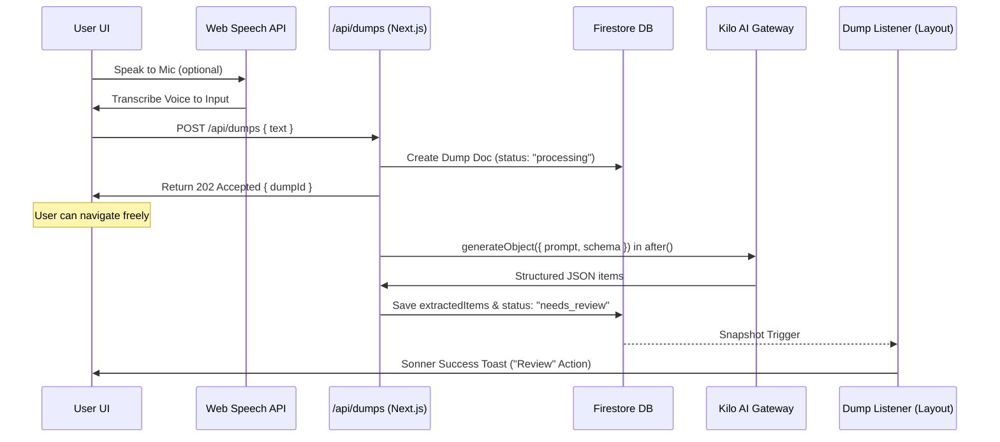

# LifeDump Application Documentation

This document describes the architecture, tech stack, data models, workflows, and file structure of the **LifeDump** application.

---

## 1. Architecture & Design Overview
LifeDump is a single-space productivity dashboard designed to help users quickly offload ("dump") tasks, expenses, and notes through text or speech. An AI model categorizes the input, which is reviewed by the user and saved to a cloud database.

The application follows a modern serverless React architecture:
*   **Frontend**: Next.js App Router (React 19) with Tailwind CSS v4.
*   **State Management**: Zustand (local UI state / pending items) and TanStack React Query (server state / caching).
*   **Authentication**: Clerk (managed authentication & user sessions).
*   **Database**: Firebase Firestore (NoSQL document storage organized by user ID).
*   **AI Engine**: Vercel AI SDK executing structured schema generation using the Kilo AI Gateway provider.

---

## 2. Technology Stack & Key Dependencies
The primary dependencies defined in `package.json` are:

| Category | Dependency | Version | Description |
| :--- | :--- | :--- | :--- |
| **Core** | `next` | `16.2.6` | Next.js Framework (App Router, Server Actions/Handlers) |
| | `react` / `react-dom` | `19.2.4` | React 19.0 UI Library |
| **Authentication** | `@clerk/nextjs` | `^7.5.3` | User identity and session management |
| **Database** | `firebase` | `^12.14.0` | Client Firestore database & Storage configuration |
| | `firebase-admin` | `^14.0.0` | Server-side Firebase Admin SDK |
| **AI Integration** | `ai` | `^6.0.206` | Vercel AI SDK for LLM prompts and structured outputs |
| | `@ai-sdk/openai` | `^3.0.71` | OpenAI provider (configured for Kilo AI Gateway) |
| **Data Fetching** | `@tanstack/react-query` | `^5.101.0` | Server state query, caching, and mutations |
| **State Management** | `zustand` | `^5.0.14` | Client-side transient state (raw text, pending items) |
| **Styling & UI** | `tailwindcss` | `^4` | Tailwind CSS v4 styling |
| | `next-themes` | `^0.4.6` | Theme management (light/dark mode toggle & system sync) |
| | `@base-ui/react` | `^1.5.0` | Headless primitive components |
| | `shadcn` | `^4.11.0` | Shadcn UI component system |
| | `lucide-react` | `^1.18.0` | Icon set |

---

## 3. Database Schema (Firebase Firestore)
All data in Firestore is partitioned under a user-centric structure. All collections are subcollections of a specific user document, ensuring privacy and isolation:

`users/{userId}/{collectionName}/{documentId}`

There are four primary collection groups:

### 1. Dumps Collection (`users/{userId}/dumps`)
Stores the raw input text submitted by the user.
*   **Fields**:
    *   `userId`: `string`
    *   `sourceType`: `"text" | "image" | "voice"`
    *   `rawText`: `string` (optional)
    *   `status`: `"queued" | "processing" | "needs_review" | "confirmed" | "failed"`
    *   `extractedItems`: `Array` of maps conforming to categorized item schemas (populated on `needs_review`)
    *   `error`: `string` (populated on `failed` status)
    *   `createdAt`: `Timestamp`
    *   `updatedAt`: `Timestamp`

### 2. Tasks Collection (`users/{userId}/tasks`)
Stores items categorized as tasks.
*   **Fields**:
    *   `userId`: `string`
    *   `dumpId`: `string` (references the dump document that generated this task)
    *   `category`: `"task"`
    *   `title`: `string`
    *   `content`: `string` (mandatory task description)
    *   `task`:
        *   `isCompleted`: `boolean`
        *   `dueAt`: `Timestamp` (optional)
    *   `aiConfidence`: `number`
    *   `createdAt`: `Timestamp`
    *   `updatedAt`: `Timestamp`

### 3. Finances Collection (`users/{userId}/finances`)
Stores transaction and cashflow records.
*   **Fields**:
    *   `userId`: `string`
    *   `dumpId`: `string`
    *   `category`: `"finance"`
    *   `title`: `string`
    *   `content`: `string` (mandatory transaction details/reason)
    *   `finance`:
        *   `type`: `"expense" | "income"`
        *   `amount`: `number`
        *   `currency`: `"IDR"`
        *   `occurredAt`: `Timestamp`
    *   `aiConfidence`: `number`
    *   `createdAt`: `Timestamp`
    *   `updatedAt`: `Timestamp`

### 4. Notes Collection (`users/{userId}/notes`)
Stores general notes or journals.
*   **Fields**:
    *   `userId`: `string`
    *   `dumpId`: `string`
    *   `category`: `"note"`
    *   `title`: `string`
    *   `content`: `string` (mandatory note details/body)
    *   `note`:
        *   `noteType`: `"general" | "journal"`
    *   `aiConfidence`: `number`
    *   `createdAt`: `Timestamp`
    *   `updatedAt`: `Timestamp`

---

## 4. Workflows & Core Mechanisms

### Workflow A: Persistent AI Categorization & Extraction


1.  **Input Submission**: The user writes text or transcribes speech in `UniversalInput` and hits "Dump".
2.  **Job Enqueue**: The client fires a non-blocking `POST` to `/api/dumps`. The Route Handler creates a Firestore document at `users/{userId}/dumps/{dumpId}` with `status: "processing"` and returns status `202` with `dumpId` instantly.
3.  **Asynchronous Parsing**: Next.js `after()` kicks in server-side, formats the Jakarta timezone details, and runs a structured `generateObject` request to the Kilo AI Gateway (`kilo-auto/free` model) with the appropriate schema:
    ```typescript
    const categorizeSchema = z.object({
      items: z.array(
        z.object({
          category: z.enum(["task", "finance", "note"]),
          title: z.string(),
          content: z.string(),
          dueAt: z.string().nullable().optional(),
          financeType: z.enum(["expense", "income"]).optional(),
          amount: z.number().optional(),
          currency: z.literal("IDR").optional(),
          occurredAt: z.string().optional(),
          confidence: z.number(),
          needsClarification: z.boolean(),
        })
      ),
      assumptions: z.array(z.string()).optional(),
    })
    ```
4.  **Job Completion**: Upon success, `after()` saves the items to `extractedItems` and updates the dump status to `"needs_review"`. If AI fails, the status updates to `"failed"` with the error trace.

### Workflow B: Dedicated Review & Refinement (AI Loop)
1.  **Global Routing Toasts**: The `DumpProcessingListener` component in the app layout runs a real-time Firestore query on active processing dumps. When status transitions to `"needs_review"`, it fires a Sonner toast with a click action to go to `/review/{dumpId}`.
2.  **Interactive Review Page**: In `/review/[id]`, the page registers an `onSnapshot` listener on the dump document. It renders the original raw text and the extracted items as editable card forms (supporting title, description, category swaps, and category-specific inputs).
3.  **AI Refinement Loop**: The user can submit refinement instructions (e.g., *"Make task 1 due next Monday"*). The client posts to `/api/dumps/{dumpId}/refine`, which updates the Firestore status to `"processing"` and launches a background refinement model run. The page's snapshot listener automatically displays the revised AI list when done.
4.  **Confirmation & Batch Save**: Clicking "Confirm All Items" executes `confirmDumpAndItems` inside `lib/firestore.ts`. This writes all finalized items to `tasks`, `finances`, or `notes` subcollections, and updates the dump document status to `"confirmed"`, returning the user to the home dashboard.

---

## 5. Directory & File Structure
```
lifedump/
├── .agents/                    # Local plugin agent scripts/skills configurations
├── app/                        # Next.js App Router root
│   ├── (app)/                  # Main Application Group (Auth Protected)
│   │   ├── finances/
│   │   │   └── page.tsx        # Financial Ledger, Cashflow Statistics & savings progress
│   │   ├── notes/
│   │   │   └── page.tsx        # Searchable grid of general/journal notes with filters
│   │   ├── review/[id]/
│   │   │   └── page.tsx        # Dedicated Review Page for AI processing verification and manual overrides
│   │   ├── tasks/
│   │   │   └── page.tsx        # Active and Completed task management lists
│   │   ├── layout.tsx          # Auth wrapper; Header, Main layout container, Bottom Nav, and background listeners
│   │   └── page.tsx            # Main dashboard: statistics overview, input panel, pending reviews queue, recent feed
│   ├── api/
│   │   ├── categorize/
│   │   │   └── route.ts        # AI categorization API (retained for legacy synchronous refinements)
│   │   └── dumps/
│   │       ├── route.ts        # Asynchronous dump submission (writes job to DB and yields immediate 202)
│   │       └── [id]/refine/
│   │           └── route.ts    # Asynchronous revision handler (shifts dump back to processing, runs refinement)
│   ├── sign-in/
│   │   └── [[...sign-in]]/     # Clerk Authentication pages
│   ├── sign-up/
│   │   └── [[...sign-up]]/     # Clerk Registration pages
│   ├── globals.css             # Main styling, custom Tailwind rules, font assignments
│   └── layout.tsx              # Root HTML wrapper with theme & auth providers
├── components/                 # React UI Components
│   ├── ui/                     # Subdirectory for individual Shadcn elements
│   ├── bottom-nav.tsx          # Bottom tab navbar with routing active states
│   ├── dump-processing-listener.tsx # Global background database listener routing status shifts to Sonner toasts
│   ├── edit-dialog.tsx         # Dialog interface to update individual item parameters
│   ├── header.tsx              # Top app navigation containing title, theme switch, user profile
│   ├── providers.tsx           # Wraps application with QueryClientProvider
│   ├── theme-provider.tsx      # Theme toggle contexts & keypress hotkeys
│   ├── theme-toggle.tsx        # Icon trigger to change theme
│   └── universal-input.tsx     # Smart input textarea with microphone toggle
├── hooks/                      # Custom React Hooks
├── lib/                        # Shared Helpers, Database Clients, Types
│   ├── firebase.ts             # Initializes client-side Firebase connections
│   ├── firestore.ts            # Houses database write operations (batch saves)
│   ├── mappers.ts              # Translates API schema structures into frontend Zustand types
│   ├── queries.ts              # Handles Firestore read, update, and delete functions
│   ├── types.ts                # Application typescript interface definitions
│   └── utils.ts                # Utility class name merge helper (cn)
├── store/                      # Zustand Local States
│   └── use-dump-store.ts       # Central store managing current input text, pending items list, status
├── AGENTS.md                   # System rules and instructions file for Agent environments
├── components.json             # Shadcn configuration file
├── next.config.ts              # Next.js specific settings
├── package.json                # Project dependencies and operational scripts
└── tsconfig.json               # Typescript compilation settings
```

---

## 6. Page & Component Details

### `app/(app)/page.tsx` (Home Dashboard)
*   **Statistics**: Computes derived indicators:
    *   Active/pending tasks count.
    *   Notes count.
    *   Net cashflow (total income minus total expenses) formatted for IDR currency.
*   **Main Input**: Embeds `<UniversalInput />` to accept new entries.
*   **Recent Dumps Feed**: Pulls the most recent 4 items using a React Query cache lookup to `getAllItems`.
    *   Different styling and logic depending on category. For tasks, includes a quick complete checkbox.
    *   For finances, prefixes signs (`-` or `+`) and formats amount.
    *   Action items: edit icon triggers `<EditDialog />`, and trash icon triggers delete operations.

### `app/(app)/tasks/page.tsx` (Tasks Dashboard)
*   Queries `getItemsByCategory(userId, 'task')`.
*   Splits items into **Active** and **Completed** lists inside separate tabs.
*   **Overdue logic**: Computes if a task's due date is earlier than today (and incomplete) and flags it with a red warning badge.

### `app/(app)/finances/page.tsx` (Finance Dashboard)
*   Queries `getItemsByCategory(userId, 'finance')`.
*   Shows summary totals: **Expenses**, **Income**, and **Net Cashflow**.
*   **Savings Rate**: Renders a custom `<Progress />` bar representing the ratio of savings to income: `(Net Cashflow / Total Income) * 100`.
*   Displays transactions in tabs: *All*, *Expenses*, or *Income*.

### `app/(app)/notes/page.tsx` (Notes Dashboard)
*   Queries `getItemsByCategory(userId, 'note')`.
*   Provides a search bar that checks note title and content body text.
*   Provides filter tabs to view: *All*, *General* notes, or *Journal* entries.

### `components/theme-provider.tsx` (Theme Engine)
*   Integrates `next-themes` with `attribute="class"`.
*   **Theme Hotkey**: Listens to global `keydown` events. If the user presses the letter `d` (case-insensitive) while not typing inside an input/textarea/select element, the theme resolved value toggles between `dark` and `light`.
